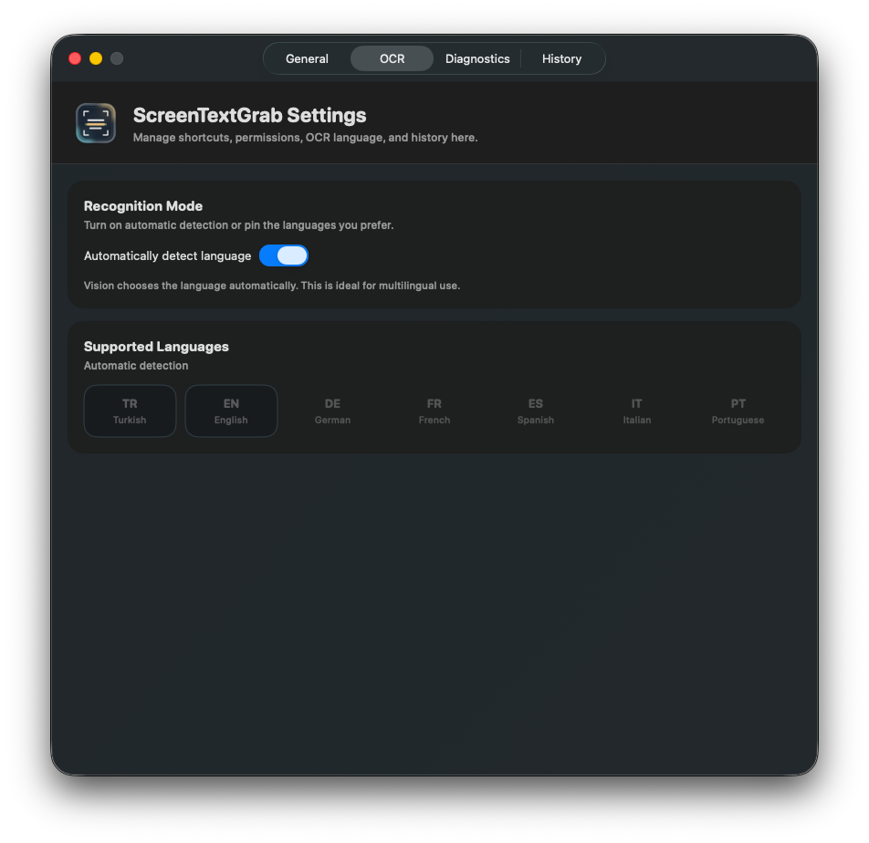
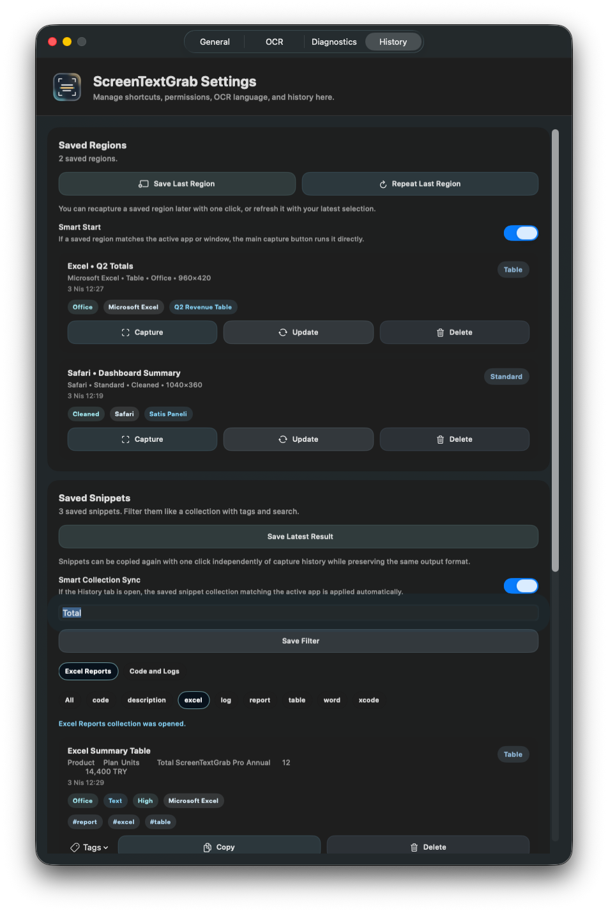
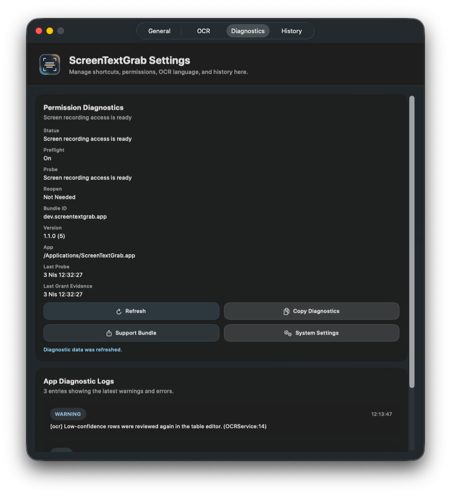

# ScreenTextGrab

[](https://github.com/batu3384/ScreenTextGrab/actions/workflows/ci.yml)
[](https://github.com/batu3384/ScreenTextGrab/releases/latest)

ScreenTextGrab is a local-first macOS menu bar OCR app for turning anything visual into usable text without leaving the app you are already working in.

It is built for:
- on-screen text capture
- video subtitles
- code snippets and terminals
- spreadsheet-like tables
- copied screenshots, image files, and PDFs

OCR runs locally with Apple's Vision framework, so screenshots and recognized text stay on the device.

The app UI supports both English and Turkish. You can keep it on `System` or switch it inside `Settings > General`. The screenshots below use the English UI for consistency.

Latest notarized release: [GitHub Releases](https://github.com/batu3384/ScreenTextGrab/releases/latest)

## At a Glance

| Area | What it does |
| --- | --- |
| Inputs | Screen regions, clipboard images, local images, PDFs, Finder imports |
| Modes | `Standard`, `Subtitle`, `Code`, `Table` |
| Outputs | `Smart`, `Plain Text`, `Cleaned`, `Office`, `Markdown`, `JSON` |
| Reuse | Saved regions, app profiles, snippets, snippet collections |
| Automation | `stg`, URL scheme, Shortcuts |
| Privacy | Local OCR with Apple's Vision framework |

## Why ScreenTextGrab

- Capture from any screen region without changing apps
- Use purpose-built OCR modes for text, subtitles, code, and tables
- Paste as plain text, cleaned text, Markdown, JSON, or rich Office output
- Keep table structure for Excel, Numbers, Word, and Pages workflows
- Reuse saved regions, snippets, and app-specific capture profiles
- OCR images and PDFs from the clipboard, Finder, or local files
- Stay inside a compact menu bar workflow instead of a heavy desktop app

## Quick Start

### Install with one command

```bash
curl -fsSL https://raw.githubusercontent.com/batu3384/ScreenTextGrab/main/scripts/bootstrap_install.sh | bash
```

This installs:
- `ScreenTextGrab.app` into `/Applications`
- the `stg` terminal helper
- the latest release when one is available
- cleanup rules so Spotlight points to the canonical app copy

After installation:

```bash
stg open
```

Or open `ScreenTextGrab` from Spotlight.

On first launch, macOS asks for Screen Recording permission once. After you allow it, reopen the app and continue normally.

Fastest path:
1. Install with the command above
2. Grant Screen Recording permission
3. Open the menu bar panel
4. Pick a mode
5. Capture and paste

### Install from a local clone

```bash
./scripts/install.sh
```

## Core Workflows

### 1. Capture text from the screen

1. Open the menu panel.
2. Pick the capture mode that matches the content.
3. Click `Capture Text`.
4. Select the screen region.
5. Paste the result into the target app.

Recommended presets:

| Content | Mode | Output |
| --- | --- | --- |
| General text | `Standard` | `Smart` |
| Subtitles | `Subtitle` | `Cleaned` |
| Code / terminal | `Code` | `Markdown` |
| Tables / lists | `Table` | `Office` |

### 2. OCR a copied screenshot or image

If you already copied an image:

1. Copy the image to the clipboard.
2. Open the `Import` menu in the menu panel.
3. Choose `Read Clipboard Image`.

You can do the same from Terminal:

```bash
stg clipboard-image --mode standard --output cleaned
```

### 3. OCR an image file

Use this when the source already exists as a PNG or JPG on disk.

Options:
- `Import > Read Image File`
- drag the image onto the menu panel
- `Open With > ScreenTextGrab` in Finder
- the Finder Services OCR action

Terminal:

```bash
stg file-image --path ~/Desktop/table.png --mode table --output office
```

### 4. OCR a PDF or create a searchable PDF

For scanned or image-based PDFs:

- `Import > Read PDF` copies OCR text from the document
- `Import > Searchable PDF` creates an exportable searchable PDF

Terminal:

```bash
stg pdf-file --path ~/Desktop/sample.pdf --mode standard --output cleaned
stg pdf-searchable --path ~/Desktop/sample.pdf --destination ~/Desktop/sample-searchable.pdf
```

### 5. Reuse frequent capture workflows

ScreenTextGrab is designed for repeated work, not just one-off OCR.

You can:
- save a screen region and run it again later
- create app-specific capture profiles
- save reusable OCR results as snippets
- group snippets into named collections
- let the panel surface the right region or snippet when the related app becomes active

If you spend all day in the same apps, this is where the product starts to feel more like a workflow tool than a one-off OCR utility.

## Feature Set

### Capture modes

| Mode | Best for |
| --- | --- |
| `Standard` | documents, UI text, dashboards, general copy |
| `Subtitle` | video subtitles, overlays, repeated lower-third text |
| `Code` | code blocks, logs, terminals, developer tools |
| `Table` | spreadsheets, price lists, multi-column layouts |

### Output formats

| Output | Use case |
| --- | --- |
| `Smart` | best default output for the selected mode |
| `Plain Text` | raw text paste |
| `Cleaned` | cleaned OCR output from noisy captures |
| `Office` | rich paste for Excel, Numbers, Word, and Pages |
| `Markdown` | notes, docs, code blocks |
| `JSON` | automation and structured post-processing |

### Table workflow

For spreadsheet-style capture:

1. Choose `Table` mode.
2. Choose `Office` output.
3. Capture the table.
4. Fix cells in the built-in table review window if needed.
5. Paste into Excel, Numbers, Word, or Pages.

### Saved regions

Use saved regions when you repeatedly OCR the same part of the screen.

Typical examples:
- the same table inside Excel
- a fixed dashboard tile
- a repeated subtitle area
- a recurring terminal panel

Saved regions can also become smarter:
- the panel can suggest them when the related app becomes active
- window-title matching improves the suggestion when accessibility access is enabled
- `Smart Start` can run the best matching region directly from the main button

### App profiles

If different apps need different OCR defaults, create an app profile.

Profiles can store:
- capture mode
- output format
- OCR language selection

Optional `Smart Panel Sync` keeps the visible menu panel settings aligned with the frontmost app profile.

### History, snippets, and collections

The app keeps recent capture history locally and lets you turn useful results into reusable assets.

You can:
- pin important history items
- save named snippets
- tag snippets
- search by name, text, app, and tag
- save filters as named snippet collections
- reopen those collections later from the UI, Terminal, URL scheme, or Shortcuts

When the related app becomes active again, ScreenTextGrab can:
- suggest the best saved region
- suggest the best snippet collection
- offer the single best matching snippet directly in the menu panel
- learn repeated snippet choices for the same app or window

### Import and Finder integration

ScreenTextGrab supports image and PDF OCR beyond on-screen capture.

Available entry points:
- clipboard image OCR
- local image file OCR
- local PDF OCR
- searchable PDF export
- drag and drop onto the menu panel
- Finder `Open With > ScreenTextGrab`
- the Finder Services OCR action

If multiple supported files are sent to the app at once, ScreenTextGrab queues
them and imports them one by one.

## Automation

ScreenTextGrab exposes lightweight automation entry points for shell tools, launchers, and Apple Shortcuts.

### `stg` terminal command

```bash
stg capture --mode table --output office
stg repeat-last --mode code --output markdown
stg saved-region --name "Safari • Revenue Table"
stg active-snippet
stg snippet --name "Price List"
stg snippet-collection --name "Excel Reports"
stg clipboard-image --mode standard --output cleaned
stg file-image --path ~/Desktop/table.png --mode table --output office
stg pdf-file --path ~/Desktop/sample.pdf --mode standard --output cleaned
stg pdf-searchable --path ~/Desktop/sample.pdf --destination ~/Desktop/sample-searchable.pdf
stg version
```

### URL scheme

```bash
open 'stg://capture?mode=table&output=office'
open 'stg://repeat-last?mode=code&output=markdown'
open 'stg://saved-region?name=Safari%20%E2%80%A2%20Revenue%20Table'
open 'stg://active-snippet'
open 'stg://snippet?name=Price%20List'
open 'stg://snippet-collection?name=Excel%20Reports'
open 'stg://clipboard-image?mode=standard&output=cleaned'
open 'stg://image-file?path=/absolute/path/to/table.png&mode=table&output=office'
open 'stg://pdf-file?path=/absolute/path/to/sample.pdf&mode=standard&output=cleaned'
open 'stg://searchable-pdf?path=/absolute/path/to/sample.pdf&destination=/absolute/path/to/sample-searchable.pdf'
```

Supported query parameters:

- `name=Saved Region or Snippet Name`
- `mode=standard|subtitle|code|table`
- `output=smart|plain-text|cleaned|office|markdown|json`
- `languages=tr,en`
- `ocr-auto=true|false`

For scripts and launchers, the URL scheme is the recommended stable entry point because it also works while the app is already running.

## Product Tour

### Menu panel

The menu panel is the day-to-day workspace for capture, mode switching, output control, quick import actions, and contextual suggestions.


### Settings: General

The General tab covers interface language, capture defaults, output presets, shortcut setup, launch-at-login, watch behavior, and app profile controls.


### Settings: OCR

The OCR tab controls automatic language detection and the recognition language set used by the capture pipeline.



### Settings: History

The History tab is the operational archive for recent captures, saved regions, reusable snippets, and saved snippet collections.



### Settings: Diagnostics

The Diagnostics tab helps verify permissions, runtime state, version details, and troubleshooting metadata.



### Table review

The table review window lets you correct OCR output cell by cell before copying it back as Office, Markdown, JSON, or plain text.


## Typical Use Cases

- Copy a subtitle from a video without pausing your workflow
- Turn a copied screenshot into editable text
- Pull a table out of a web page and paste it into Excel
- Convert a scanned PDF into a searchable document
- Save a recurring dashboard area and rerun it later with one click
- Keep reusable OCR results as snippets for the apps you use every day

## Privacy

ScreenTextGrab does not upload screenshots or OCR results to a remote service. OCR runs locally with Apple's Vision framework. The app requests Screen Recording permission because macOS requires it for region capture.

## Requirements

- macOS 14 or newer
- Xcode 15 or newer only if you are building from source

## Project Docs

- [Release downloads](https://github.com/batu3384/ScreenTextGrab/releases/latest)
- [Contributing guide](CONTRIBUTING.md)
- [Manual smoke matrix](docs/MANUAL_SMOKE_MATRIX.md)
- [Security policy](SECURITY.md)
- [Release checklist](RELEASE_CHECKLIST.md)
- [GitHub publishing guide](docs/GITHUB_PUBLISHING.md)
- [License](LICENSE)

## UI Maintenance

- Refresh README screenshots with `./scripts/capture_preview_screenshots.sh`
- Run the release-facing visual and workflow checks in [docs/MANUAL_SMOKE_MATRIX.md](docs/MANUAL_SMOKE_MATRIX.md) after material UI changes
