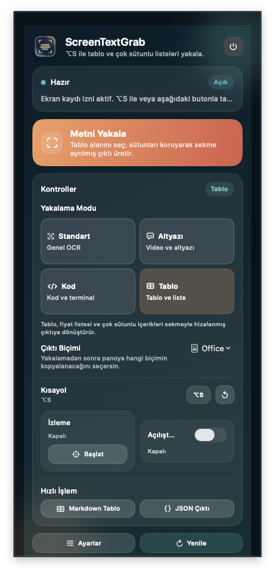
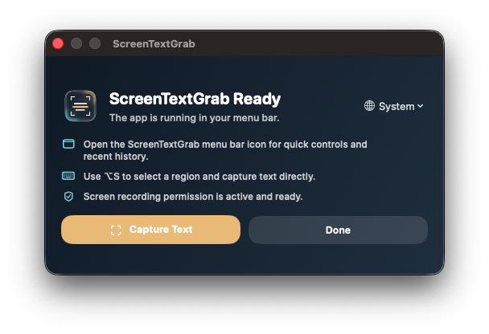
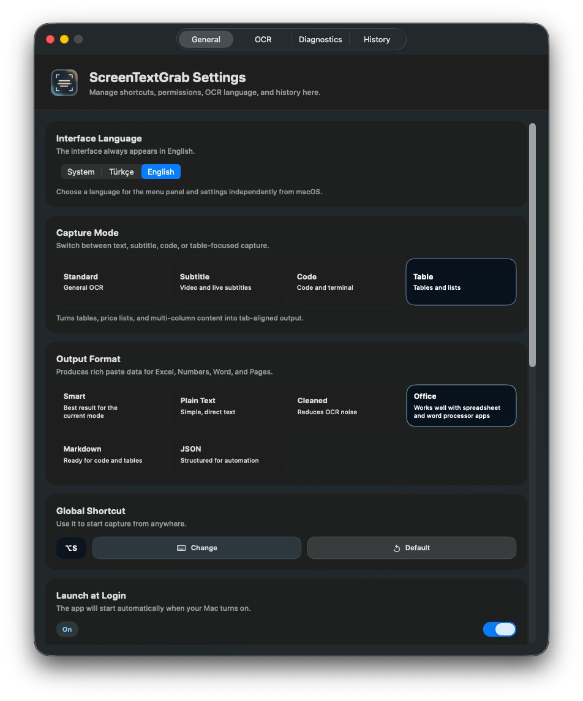
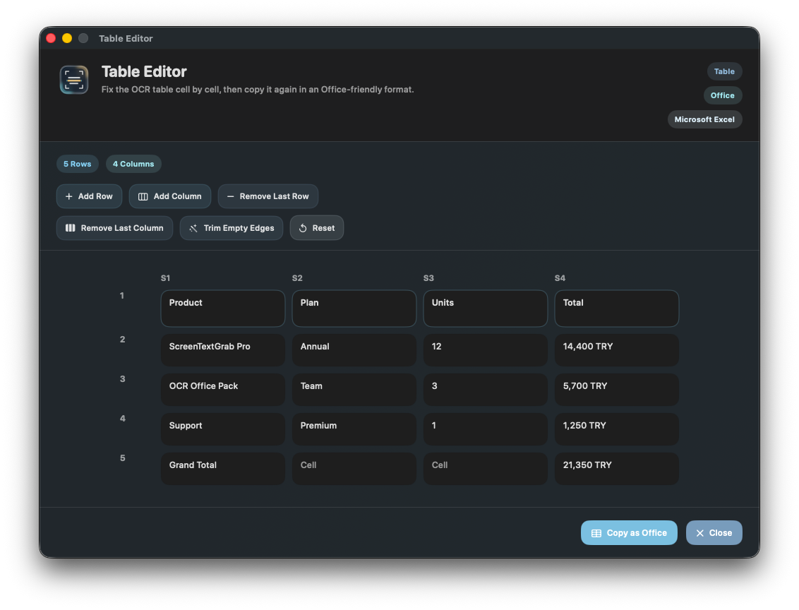

# ScreenTextGrab

[](https://github.com/batu3384/ScreenTextGrab/actions/workflows/ci.yml)

ScreenTextGrab is a macOS menu bar OCR app for capturing text from any on-screen region and pasting it back in the format that fits the job.

It is designed for fast everyday capture, code snippets, subtitles, and spreadsheet-like tables. OCR runs locally with Apple's Vision framework, so screenshots and recognized text stay on the device.



## What it does well

- Captures text from any on-screen region without changing apps
- Exposes a global shortcut for quick region selection
- Switches between `Standard`, `Subtitle`, `Code`, and `Table` OCR modes
- Copies results as `Plain Text`, `Cleaned`, `Markdown`, `JSON`, or rich `Office` output
- Preserves row and column structure for Excel, Numbers, and Word workflows
- Includes a table review editor for fixing OCR-extracted tables before pasting again
- Keeps a local copy history for recent captures
- Runs as a focused menu bar utility instead of a full desktop workspace

## Why ScreenTextGrab exists

Most OCR tools are good at turning pixels into text, but weak at preserving intent. A subtitle should not be treated like a terminal log, and a table should not come back as a flat paragraph.

ScreenTextGrab changes the OCR strategy based on the content you are capturing, then formats the clipboard output for the target workflow. The result is a smaller, faster macOS utility that is much better at practical copy-paste work.

## Core workflows

### Capture modes

- `Standard`: balanced OCR for documents, app UI, dashboards, and general interface text
- `Subtitle`: tuned for lower-third text, repeated subtitle sampling, and video overlays
- `Code`: preserves line structure, symbols, and whitespace more carefully
- `Table`: extracts rows and columns for office apps and spreadsheet-like layouts

### Output presets

- `Smart`: best default output for the selected capture mode
- `Plain Text`: direct unformatted text
- `Cleaned`: OCR cleanup for noisy captures
- `Office`: rich clipboard output for Excel, Numbers, Word, and Pages
- `Markdown`: structured output for notes, docs, and code blocks
- `JSON`: structured output for automation or post-processing

### Office-ready table workflow

1. Choose `Table` mode.
2. Choose `Office` output.
3. Capture the table region.
4. If needed, fix rows or columns in the built-in table review window.
5. Paste into Excel, Numbers, Word, or Pages with preserved structure.

## Screenshots

| Menu Panel | Launch Panel |
| --- | --- |
|  |  |

| Settings | Table Review |
| --- | --- |
|  |  |

## Privacy

ScreenTextGrab does not upload screenshots or OCR results to a remote service. OCR runs locally with Apple's Vision framework. The app asks only for Screen Recording permission because macOS requires it for region capture.

## Requirements

- macOS 14 or newer
- Xcode 15 or newer
- [XcodeGen](https://github.com/yonaskolb/XcodeGen)

## Local development

Generate the project:

```bash
xcodegen generate --spec project.yml
```

Run the repository audit:

```bash
./scripts/repo_audit.sh
```

Run unit tests:

```bash
xcodebuild test \
  -project ScreenTextGrab.xcodeproj \
  -scheme ScreenTextGrab \
  -only-testing:ScreenTextGrabTests \
  -destination 'platform=macOS' \
  CODE_SIGNING_ALLOWED=NO \
  CODE_SIGNING_REQUIRED=NO \
  CODE_SIGN_IDENTITY=''
```

Run UI tests:

```bash
xcodebuild test \
  -project ScreenTextGrab.xcodeproj \
  -scheme ScreenTextGrab \
  -only-testing:ScreenTextGrabUITests \
  -destination 'platform=macOS' \
  CODE_SIGN_STYLE=Manual \
  CODE_SIGN_IDENTITY='-' \
  AD_HOC_CODE_SIGNING_ALLOWED=YES \
  DEVELOPMENT_TEAM=''
```

Build a local release candidate without signing:

```bash
xcodebuild build \
  -project ScreenTextGrab.xcodeproj \
  -scheme ScreenTextGrab \
  -configuration Release \
  CODE_SIGNING_ALLOWED=NO \
  CODE_SIGNING_REQUIRED=NO \
  CODE_SIGN_IDENTITY=''
```

## Public release

For a public macOS release you still need:

1. Your own Apple Developer team in Xcode with `Developer ID Application`
2. Notarization credentials through one of these paths:
   - `xcrun notarytool store-credentials`
   - `SCREEN_TEXT_GRAB_APPLE_ID` + `SCREEN_TEXT_GRAB_APP_SPECIFIC_PASSWORD`
   - App Store Connect API key environment variables

Build, notarize, and verify:

```bash
SCREEN_TEXT_GRAB_TEAM_ID="<YOUR_TEAM_ID>" \
./scripts/build_release.sh

SCREEN_TEXT_GRAB_NOTARY_PROFILE="your-notary-profile" \
./scripts/notarize_release.sh

./scripts/verify_release.sh
```

Release detail:

- [RELEASE_CHECKLIST.md](RELEASE_CHECKLIST.md)
- [RELEASE_NOTES.md](RELEASE_NOTES.md)
- [CHANGELOG.md](CHANGELOG.md)

## GitHub publishing

Repository publishing commands, release workflow, suggested repo description, and `gh` CLI steps are documented here:

- [docs/GITHUB_PUBLISHING.md](docs/GITHUB_PUBLISHING.md)

## Open source project files

- [CONTRIBUTING.md](CONTRIBUTING.md)
- [SECURITY.md](SECURITY.md)
- [LICENSE](LICENSE)
